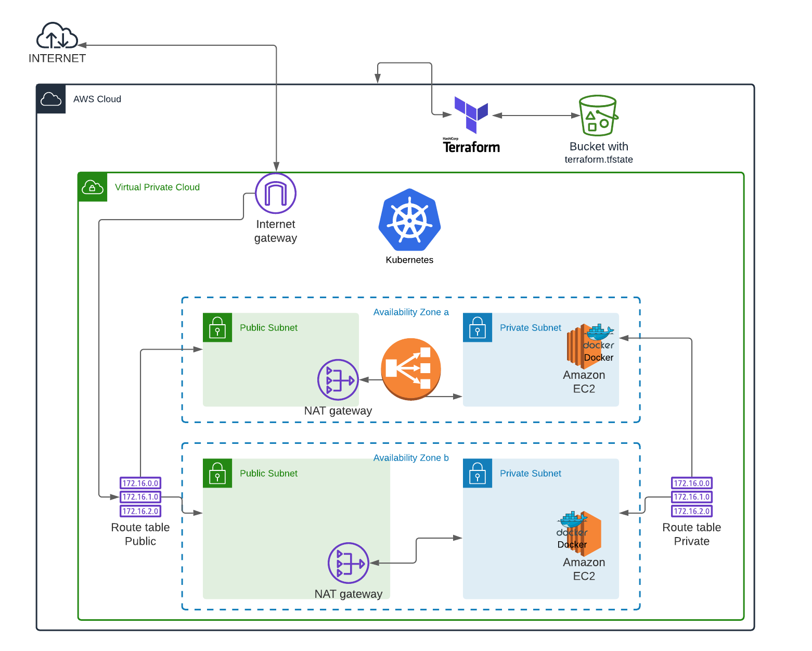

# Eks-terraform-K8s-


## Schematic:



## Overview of the GitHub repository:

```zsh
Eks-terraform-K8s-Helm
├── modules
│   ├── EKS                         # → EKS and Nodes
│   │   ├── main.tf
│   │   ├── outputs.tf
│   │   └── variables.tf
│   ├── iamRole                     # → AWS IAM and policies
│   │   ├── main.tf
│   │   ├── outputs.tf
│   │   └── variables.tf
│   └── vpc                         # → Vpc, subnets, igw, ngw, and Security Group.
│       ├── main.tf
│       ├── outputs.tf
│       └── variables.tf
├── note.txt
├── eksproject.tf                   # → File responsible for AWS authentication, and also for calling all modules.
├── eksproject.tfvars               # → Contains variables, and settings for the structure.
├── service.yaml                    # → Yaml file to expose the pods outside of nodes.
└── web.yaml                        # → Yaml file to that add the image of the docker inside of the  K8s pods.
```

## Getting Started

These instructions will cover using, setup, and testing the project.

### Prerequisites

In order to run this project it is necessary to install kubectl, terraform and AWS-CLi:

kubectl:

- [Windows](https://kubernetes.io/docs/tasks/tools/install-kubectl/)
- [OS X](https://kubernetes.io/docs/tasks/tools/install-kubectl/)
- [Linux](https://kubernetes.io/docs/tasks/tools/install-kubectl/)

Terraform:

- [Windows](https://www.terraform.io/downloads.html)
- [OS X](https://www.terraform.io/downloads.html)
- [Linux](https://www.terraform.io/downloads.html)

AWS:

- [Windows](https://docs.aws.amazon.com/cli/latest/userguide/install-cliv2-windows.html)
- [OS X](https://docs.aws.amazon.com/cli/latest/userguide/install-cliv2-mac.html)
- [Linux](https://docs.aws.amazon.com/cli/latest/userguide/cli-chap-install.html)

## Terraform setup

---

**1\. Clone this repository (linux or macOs)**

```sh
$ git clone https://github.com/Bramba7/Terraform-eks-k8s.git
$ cd Terraform-eks-k8s
```

**2\. Configuring credentials for AWS**

```bash
$ export AWS_SECRET_ACCESS_KEY='your secret key'
$ export AWS_ACCESS_KEY_ID='your key id'
$ export region='your region'
$ export output= 'json or yaml'
```

... or the `~/.aws/credentials` and `~/.aws/config` file.

```
$ cat ~/.aws/credentials
[default]
aws_access_key_id = your key id
aws_secret_access_key = your secret key

```

```
$ cat ~/.aws/config
[default]
region= your region
output= json or yaml

```

**3\. Create a bucket on AWS**

Replace the word "mybucket for the name of your bucket, and the us-west-1 region with your preferred region.
<br><font color="red"><b> Attention the name of your bucket must be a unique name!!!!</b> </font>

```sh
$ aws s3 mb s3://mybucket --region YOUR REGION
```

**4\. Edit the code with your information**

<dl>
  <dt><b>First Step</b></dt>
  <dd> Open the eksproject.tfvars and change que aws region.</dd>
  <dt><b>Second Step</b></dt>
  <dd>In the same file "eksproject.tfvars", change the variables that best suit your needs . </dd>
  <dt><b>Last Step</b></dt>
  <dd>After completing the previous steps open the file `eksproject.tf`, and fill this section with your data from the AWS S3 bucket as in the code below:<dd>
</dl>

```
terraform {
  required_version = ">= 0.12.0"
  backend "s3" {
    shared_credentials_file = "~/.aws/credentials"
    bucket = "bucket's name"
    key    = "Folder's name /terraform.tfstate"
    region = "preference region"
    acl = "private"
    encrypt = true
  }
}
```

## Terraform Usage

---

**1\. Initialize terraform on the directory**

Execute the below command to initialize.

```sh
$ terraform init
```

**2\. Review the Terraform plan**

Execute the below command and ensure you are happy with the plan.

```bash
$ terraform plan -var-file="eksproject.tfvars"
```

**3\. Execute terraform project**

For more agility you can use the command `--auto-approve` to skip the execution confirmation.

```sh
$ terraform apply -var-file="eksproject.tfvars"
```

**4\. Delete terraform project**

Once you are finished your testing, ensure you destroy the resources to avoid unnecessary AWS charges.

```sh
$ terraform destroy -var-file="eksproject.tfvars"
```

## Test K8S

---

**1\. Connecting k8s with aws**

```sh
$ aws eks update-kubeconfig --name <clustername>
```

The K8s create the pods and add the nginx container

```sh
$ kubectl apply -f web.yaml
```

You can list the pods to see what is up and running:

```sh
$ kubectl get pods
```

You can also see the deployment that was created:

```sh
$ kubectl get deployment
```

You can also scale the deployment to ensure there is two nginx pods running:

```sh
kubectl scale deployment --replicas 3 webpage
```

Exposing your pods to the internet

```sh
$ kubectl apply -f service.yaml
```

This should print the service that has been created, and map an external IP address to the service. Where to find this external IP address will depend on the environment you run in.

```sh
$ kubectl get service
```

Delete all service

```sh
$ kubectl delete service --all
```

Delete all deployment

```sh
$ kubectl delete deployment --all
```
